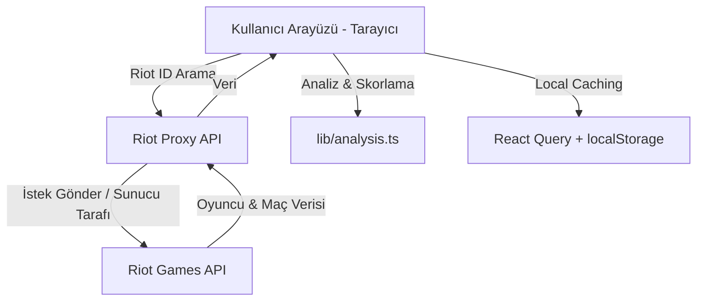

# 🗺️ lol-flex-metics - Detaylı Özellik Dökümantasyonu (Feature Spec)

Bu dökümanda, **lol-flex-metics** projesinde yer alan tüm özellikler (features), hesaplama metrikleri, arka planda dönen mantık ve uygulanan Türkçe oyuncu mizahı detaylı bir şekilde açıklanmıştır.

## 🚀 Genel Bakış
lol-flex-metics; takip ettiğiniz oyuncuların **flex 5v5 (queue 440)** maçlarını Riot API üzerinden çekip analiz eden, **Next.js + React Query** kullanılarak geliştirilmiş modern bir web uygulamasıdır. 
Tüm analiz sonuçları ve kullanıcı arayüzü metinleri, LoL jargonunu yansıtan hafif alaycı ve eğlenceli bir Türkçe üslup ile sunulmaktadır.

---

## 🛠️ Teknik Mimari ve Veri Akışı

Uygulamanın veri akışı ve mimarisi aşağıdaki gibidir:

- **Riot Proxy API**: Riot API anahtarının güvenliği ve tarayıcıdaki CORS engellerini aşmak amacıyla istekler [route.ts](file:///C:/Users/user/lol-flex-metics/app/api/riot/[...slug]/route.ts) dosyasındaki sunucu proxy'si üzerinden geçirilmektedir.
- **Local Caching**: Çekilen veriler gereksiz API isteklerini önlemek adına **React Query** ve **localStorage** üzerinde önbelleğe alınır.
- **Analitik Modül**: Tüm istatistiksel ve analitik hesaplamalar [analysis.ts](file:///C:/Users/user/lol-flex-metics/lib/analysis.ts) dosyasındaki saf fonksiyonlar (pure functions) aracılığıyla yapılır.

---

## 🌟 Detaylı Özellikler

### 1. Kullanıcı Yönetimi (Sınırsız Oyuncu Ekleme)
* **Dosya**: [UserManager.tsx](file:///C:/Users/user/lol-flex-metics/components/UserManager.tsx)
* **Açıklama**: Oyuncular Riot ID (`İsim#TAG`) formatında aranarak sisteme sınırsızca eklenir. Oyuncu profilleri tarayıcı yerel depolamasında tutulduğu için uygulama her açıldığında tekrar yüklenir.

---

### 2. Şampiyon Raporları ("Tanrı mı, Besleme mi?")
* **Dosya**: [ChampionReport.tsx](file:///C:/Users/user/lol-flex-metics/components/ChampionReport.tsx) ve [analysis.ts](file:///C:/Users/user/lol-flex-metics/lib/analysis.ts#L117-L143)
* **Açıklama**: Oyuncuların en az 2 maç oynadığı şampiyonlar üzerinden en başarılı ve en başarısız performansları listelenir.
* **Gamer Tier Seviyeleri (WR ve Maç Sayısına Göre)**:
  | Tier Seviyesi | Şart | Açıklama |
  | :--- | :--- | :--- |
  | **UNRANKED** | Toplam Maç = 0 | Henüz maç verisi çekilmemiş oyuncu. |
  | **ÇIRAK** | Toplam Maç < 3 | Gelişmekte olan oyuncu. |
  | **S+ ALLAH** | WR > %55 | İlah gibi oynayan, flexin efendisi. |
  | **A CARRY** | WR ≥ %50 | Sırtlayıcı güç, güvenli liman. |
  | **F MAL** | WR < %50 | Takıma yük olan, feedleyen oyuncu. |

* **Şampiyon Bazlı Lakaplar (Roast Sistemi)**:
  * **Kazanma Oranı (Winrate) Yorumları** (`wrRoast`):
    * `%70 ve üzeri`: *"tanrı modu, smurf bunlar"*
    * `%55 - %69`: *"fena değil reis"*
    * `%45 - %54`: *"ne iyi ne kötü, ekmeğini yiyor"*
    * `%30 - %44`: *"yük, takımı sırtında taşıtıyor"*
    * `%30 altı`: *"besleme kral, en çok domalan"*
  * **KDA Yorumları** (`kdaRoast`):
    * `KDA ≥ 5`: *"elinde silah var resmen"*
    * `3 ≤ KDA < 5`: *"idare eder"*
    * `1.5 ≤ KDA < 3`: *"ortalama bir fani"*
    * `1 ≤ KDA < 1.5`: *"ölmeyi seviyor"*
    * `KDA < 1`: *"haritaya feed dağıtıyor"*

---

### 3. Şampiyon Bazlı Sıralama (Champion Leaderboard)
* **Dosya**: [ChampionLeaderboard.tsx](file:///C:/Users/user/lol-flex-metics/components/ChampionLeaderboard.tsx) ve [analysis.ts](file:///C:/Users/user/lol-flex-metics/lib/analysis.ts#L145-L190)
* **Açıklama**: Eklenen tüm oyuncuların ortak oynadığı şampiyonların listelendiği sıralama tablolarıdır.
* **Detaylar**:
  * Şampiyon kartları kendi aralarında toplam maç sayısı, en yüksek winrate, oyuncu sayısı ya da alfabetik olarak sıralanabilir.
  * Her şampiyon kartının içinde, o şampiyonu oynayan oyuncular başarıya göre (önce WR, sonra KDA, ardından maç sayısı) sıralanır.
  * Kullanıcılar arama kutusunu kullanarak spesifik bir şampiyonu filtreleyebilirler.

---

### 4. İkili Sinerji Analizi ("Kim Kimi Taşıyor?")
* **Dosya**: [Connections.tsx](file:///C:/Users/user/lol-flex-metics/components/Connections.tsx) ve [analysis.ts](file:///C:/Users/user/lol-flex-metics/lib/analysis.ts#L229-L283)
* **Açıklama**: Oyuncular arasındaki ikili etkileşimleri ölçerek kimlerin birbirini yukarı taşıdığını ya da aşağı çektiğini hesaplar.
* **Matematiksel Mantık (Pair Lift Calculation)**:
  1. İki oyuncunun (A ve B) tekil olarak oynadıkları maçlardaki genel winrate ortalaması alınır:
     $$\text{bazWR} = \frac{\text{overallWinRate}(A) + \text{overallWinRate}(B)}{2}$$
  2. A ve B'nin aynı takımda ve aynı maçta oynadığı karşılaşmalardaki winrate hesaplanır:
     $$\text{birlikteWR} = \frac{\text{birlikte kazanılan maçlar}}{\text{birlikte oynanan toplam maçlar}}$$
  3. Lift (Sinerji Değeri) belirlenir:
     $$\text{lift} = \text{birlikteWR} - \text{bazWR}$$
* **Çıktı Örnekleri**:
  * **Pozitif Sinerji**: A + B birlikte olunca winrate **+%15** artıyor.
  * **Negatif Sinerji**: A + B birlikte olunca winrate **-%20** düşüyor.
  * *Not*: İstatistiksel sapmaları önlemek adına "Minimum birlikte maç sayısı" filtresi (varsayılan: 3) uygulanmaktadır.

---

### 5. Kadro Kombinasyon Analizi ("Carry mi, Sirk mi?")
* **Dosya**: [ComboAnalysis.tsx](file:///C:/Users/user/lol-flex-metics/components/ComboAnalysis.tsx) ve [analysis.ts](file:///C:/Users/user/lol-flex-metics/lib/analysis.ts#L285-L330)
* **Açıklama**: Eklenen oyuncu listesinden seçilen **3'lü** ya da **5'li** grupların aynı takımda birlikte girdikleri maçlardaki performansını listeler.
* **Detaylar**:
  * Tüm kombinasyonlar taranarak bu grupların aynı takımda (`teamId` eşit) olduğu flex maçları süzülür.
  * Grup halinde oynadıkları toplam maç, galibiyet/mağlubiyet sayıları ve net kazanma oranları (winrate) gösterilir.

---

### 6. Performans Karnesi ("Efsane Kareler & Utanç Müzesi")
* **Dosya**: [Highlights.tsx](file:///C:/Users/user/lol-flex-metics/components/Highlights.tsx) ve [analysis.ts](file:///C:/Users/user/lol-flex-metics/lib/analysis.ts#L35-L48)
* **Açıklama**: Seçilen bir oyuncunun flex maçlarında sergilediği en iyi 3 maçı ("🔥 Efsane kareler") ve en kötü 3 maçı ("💀 En çok domaldığı maçlar") listeler.
* **Performans Puanı (Rating) Formülü**:
  Her maçtaki oyuncu performansı şu formülle puanlanır:
  $$\text{Rating} = (\text{KDA} \times 2) + (\text{Kill Participation} \times 10) + (\text{CS/dk} \times 0.3) + (\text{win} ? 3 : 0) + (\text{largestMultiKill} \times 1.5) - (\text{deaths} \times 0.4)$$
  * *KDA*: $\frac{\text{Kills} + \text{Assists}}{\max(1, \text{Deaths})}$
  * *Kill Participation*: $\frac{\text{Kills} + \text{Assists}}{\text{Takımın Toplam Kill Sayısı}}$
  * *CS/dk*: Dakika başına kesilen minyon ve orman canavarı sayısı.

---

### 7. Takım Kurucu (Team Builder)
* **Dosya**: [TeamBuilder.tsx](file:///C:/Users/user/lol-flex-metics/components/TeamBuilder.tsx)
* **Açıklama**: Aktif seçilen oyuncuları rastgele iki takıma (Mavi Takım / Kırmızı Takım) böler.
* **Detaylar**:
  * Takımların dengelenmesi amacıyla oyuncular karıştırılarak (`shuffle`) eşit bölünür.
  * İsteğe bağlı olarak oyunculara rastgele League of Legends rolleri (`TOP`, `JUNGLE`, `MID`, `BOT`, `SUPPORT`) atanır.

---

### 8. Mini Oyun ("Who is that AGAmon?")
* **Dosya**: [GuessGame.tsx](file:///C:/Users/user/lol-flex-metics/components/GuessGame.tsx)
* **Açıklama**: Eklenen oyuncuların flex maçlarından birine ait detaylı istatistikler (KDA, Kill Katılımı, CS/dk, Hasar, Görüş Skoru, Şampiyon Seviyesi, Oyun Süresi ve Win/Loss) gösterilir ve bu maçın hangi oyuncuya ait olduğu tahmin edilmeye çalışılır.
* **Detaylar**:
  * Doğru bilindiğinde eğlenceli tebrik metinleri gösterilir.
  * Yanlış tahminde bulunulduğunda şampiyon resmi ve ismi ipucu olarak açılır.
  * Oyuncunun ilk tahmindeki başarı oranı skor paneli üzerinden takip edilir.
